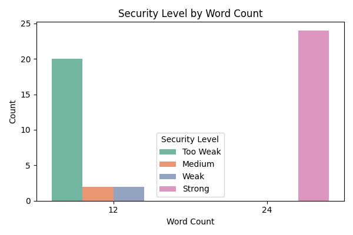
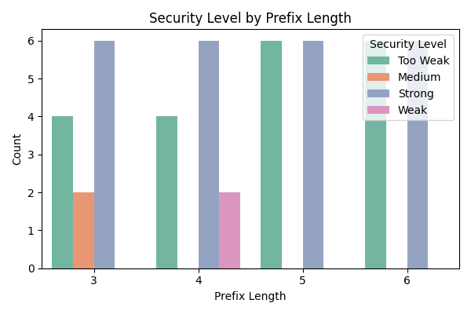
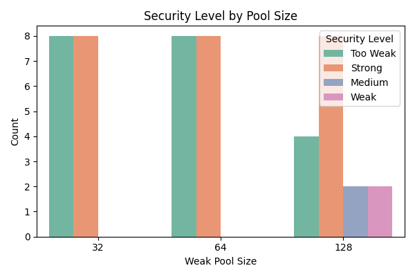
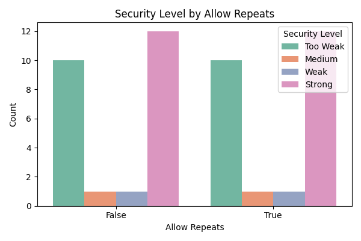

# Comparative Analysis of Mnemonic Phrase Security Levels

This section presents a comparative experiment that evaluates how different mnemonic generation parameters affect the theoretical security level of blockchain wallets. The security level is assessed based on the estimated time to successfully brute-force the mnemonic phrase, considering a decryption speed of 10^10 attempts per second.

---

## Experimental Variables

| Parameter        | Values                  |
|------------------|--------------------------|
| `word_count`     | 12, 24                   |
| `prefix_length`  | 3, 4, 5, 6               |
| `weak_pool_size` | 32, 64, 128              |
| `allow_repeats`  | True, False              |

---

## Security Classification Standard

| Security Level | Time Cost Estimate       | Estimated Entropy (log₂) |
|----------------|---------------------------|---------------------------|
| Too Weak       | Less than 1 month         | < 40 bits                 |
| Weak           | 1 month – 1 year          | 40–60 bits                |
| Medium         | 1 year – 100 years        | 60–80 bits                |
| Strong         | More than 100 years       | > 80 bits                 |

> When the security level based on time and entropy differs, the lower level is chosen.

---

## Experimental Results and Analysis

### 1. The relationship between Security Level and Word Count

- **Observation**: All 24-word mnemonics fall into the **Strong** category.
- **In contrast**, most 12-word mnemonics are **Too Weak**, with only a few reaching Medium or Weak levels.
- **Conclusion**: Increasing `word_count` is the most effective way to improve security.

---

### 2. The relationship between Security Level and Prefix Length

- **Observation**: As `prefix_length` increases from 3 to 6, the number of **Too Weak** cases increases significantly.
- **Explanation**: A longer prefix leaves fewer unknown words (`r = word_count - prefix_length`), reducing entropy.
- **Conclusion**: Avoid overly long fixed prefixes when generating mnemonics.

---

### 3. The relationship between Security Level and Weak Pool Size

- **Observation**:
  - Pool size 32 and 64 yield only **Too Weak** and **Strong** levels (indicating a threshold effect).
  - Pool size 128 produces the full range, including **Medium** and **Weak**.
- **Conclusion**: Expanding the weak entropy pool significantly increases security variability and potential strength.

---

### 4. The relationship between Security Level and Allow Repeats

- **Observation**: Allowing or disallowing repetition leads to nearly symmetrical distribution.
- **Explanation**: For the given test cases, `allow_repeats` has limited impact on entropy, because most cases use a sufficiently large pool.
- **Conclusion**: While not critical alone, this factor can matter when `pool_size` is small and `word_count` is high.

---

## Key Insights

- Mnemonics of 24 words are categorically safer than 12-word versions.
- Using short prefixes and large weak pools is essential to avoid "Too Weak" configurations.
- The interaction between variables is non-linear: e.g., increasing pool size only helps when the prefix length is not too long.

---

## Recommendation

To ensure a mnemonic phrase achieves at least a **Medium** or **Strong** level of security, we recommend:

- Always use **24 words**.
- Keep fixed prefixes to **3–4 words max**.
- Use weak pools with **at least 128 words**.
- Enable randomness (i.e., allow repeats if needed).

---
