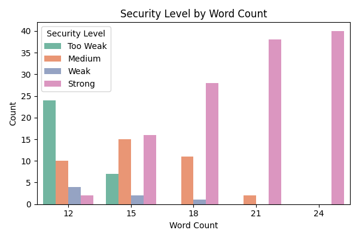
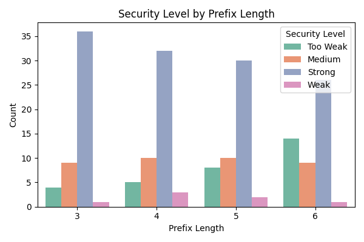
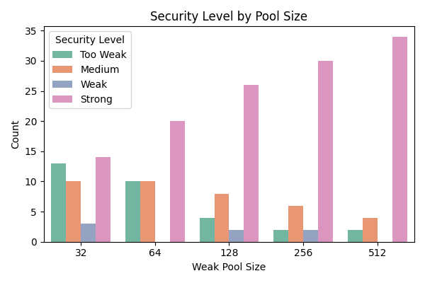
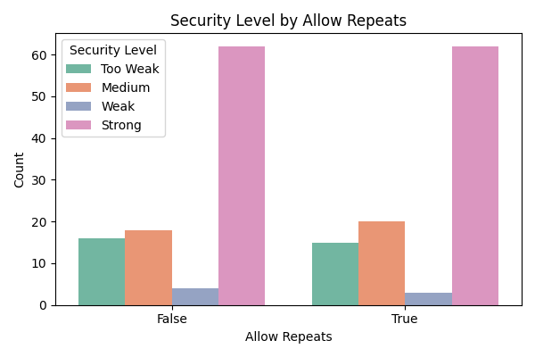

# Comparative Analysis of Mnemonic Phrase Security Levels

This section presents a comparative experiment that evaluates how different mnemonic generation parameters affect the theoretical security level of blockchain wallets. The security level is assessed based on the estimated time to successfully brute-force the mnemonic phrase, considering a decryption speed of 10^10 attempts per second (The decryption speed of the A100 GPU).

---

## Experimental Variables

| Parameter        | Values                  |
|------------------|--------------------------|
| `word_count`     | 12, 15, 18, 21,  24      |
| `prefix_length`  | 3, 4, 5, 6               |
| `weak_pool_size` | 32, 64, 128, 256, 512    |
| `allow_repeats`  | True, False              |

---

## Security Classification Standard

| Security Level | Time Cost Estimate       | Estimated Entropy (log₂) |
|----------------|---------------------------|---------------------------|
| Too Weak       | Less than 1 month         | < 40 bits                 |
| Weak           | 1 month – 1 year          | 40–60 bits                |
| Medium         | 1 year – 100 years        | 60–80 bits                |
| Strong         | More than 100 years       | > 80 bits                 |

In this experiment, we use the following classification standard:

- **Too Weak**: The estimated time to brute-force the mnemonic is less than 1 month.
- **Weak**: The estimated time to brute-force the mnemonic is between 1 month and 1 year.
- **Medium**: The estimated time to brute-force the mnemonic is between 1 year and 100 years.
- **Strong**: The estimated time to brute-force the mnemonic is more than 100 years.

> When the security level based on time and entropy differs, the lower level is chosen.

---

## Experimental Results and Analysis

### 1. The relationship between Security Level and Word Count

- **Observation**
  - 12-word mnemonics are mostly classified as **Too Weak** or **Medium**, with only a few reaching the level of **Weak** or **Strong**. 
  - The 15-word mnemonic significantly improved, with most achieving Medium or Strong levels. 
  - 18-word mnemonic scheme is overall leaning towards **Strong**, with only a few falling into the **Medium** category. 
  - The 21-word and 24-word versions are all classified under the **Strong** category.
- **Conclusion**: Security increases almost exponentially with word_count. Starting from 18 words, almost all configurations have become so strong that they exceed the cracking time of a century.

---

### 2. The relationship between Security Level and Prefix Length

- **Observation**: As `prefix_length` increases, the number of **Too Weak** cases increases significantly.
- **Conclusion**: Avoid overly long fixed prefixes when generating mnemonics.

---

### 3. The relationship between Security Level and Weak Pool Size

- **Observation**:
  - When the pool size is 32 or 64, **Too Weak** and **Medium** account for a large proportion, making it difficult to ensure long-term security. 
  - When the pool size is 128 or larger, the security level significantly improves, and "Strong" clearly takes the dominant position.
  - When the pool size is 512, almost all cases are classified as **Strong**.
- **Conclusion**: Expanding the weak entropy pool significantly increases security variability and potential strength.

---

### 4. The relationship between Security Level and Allow Repeats

- **Observation**: Allowing or disallowing repetition leads to nearly symmetrical distribution.
- **Conclusion**: While not critical alone, this factor can matter when `pool_size` is small and `word_count` is high.

---

## Recommendation

To ensure a mnemonic phrase achieves at least a **Medium** or **Strong** level of security, we recommend:

- Always use at least **18 words**, and preferably **24 words** to ensure the highest level of security.
- Avoid using long fixed prefixes to **3–4 words max**, as longer prefixes sharply reduce remaining entropy.
- Use a sufficiently large candidate word list: A scheme with a word list capacity of less than 128 words is unreliable; actual security begins with a 128-word word list and is significantly enhanced when the word list size reaches 512 words.
- Whether to allow repetition does not have any significant impact when the word count is greater than or equal to 12 and the prefix length is less than or equal to 6. However, to increase entropy, it is best to allow repetition.
- To effectively resist brute-force attacks in the long term, a minimum security baseline should be set with at least 18 characters, a character pool size of at least 128, and no more than 3 known prefixes.

---
