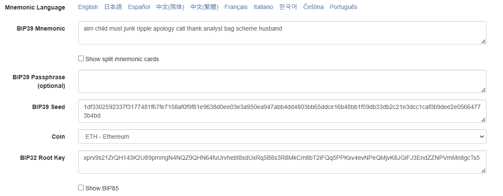
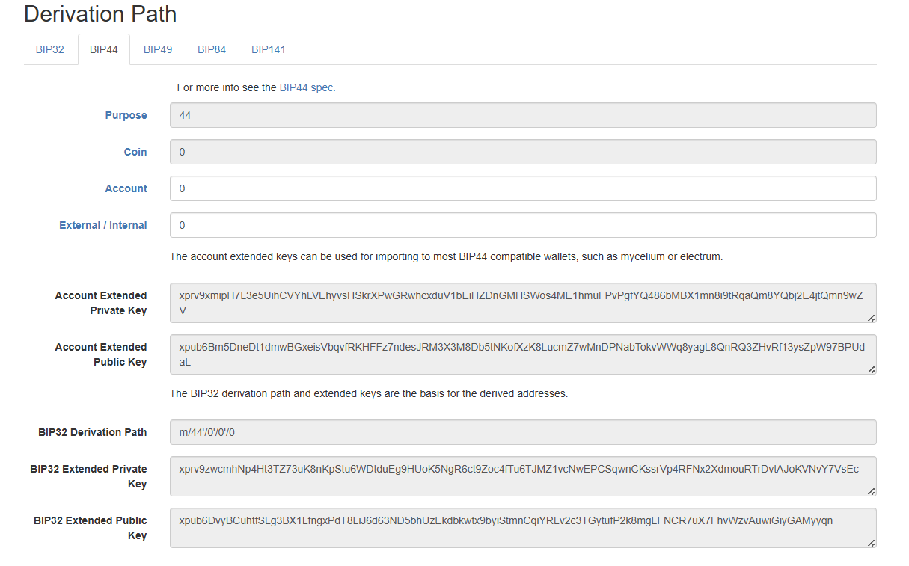
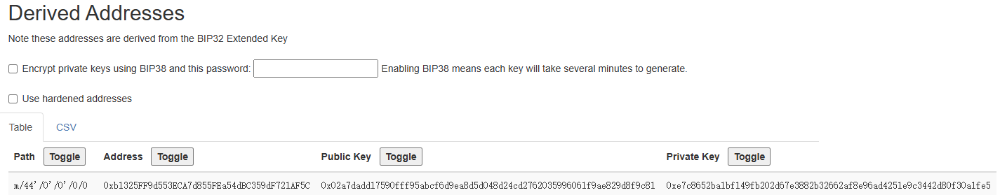
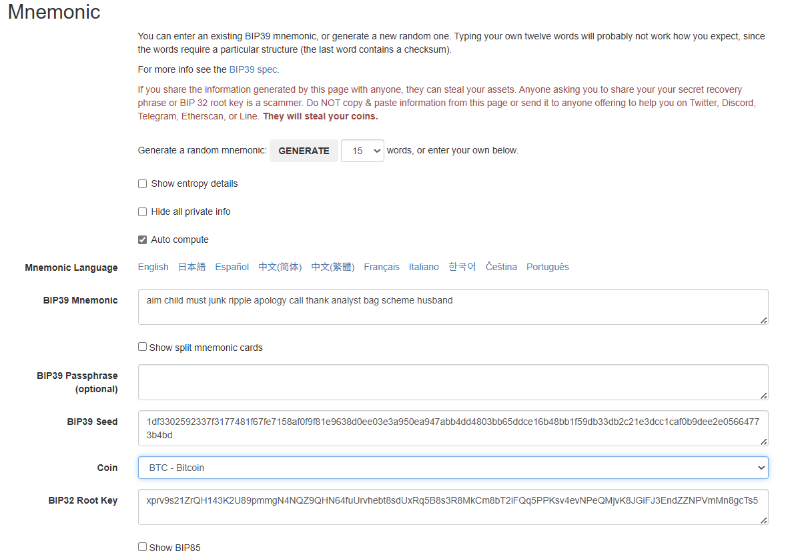
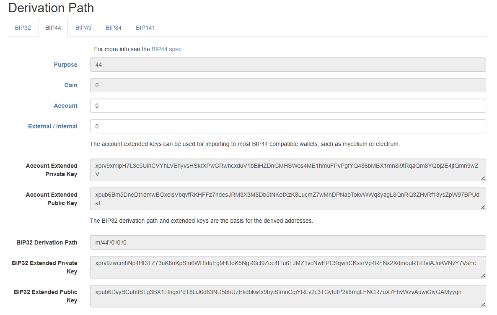
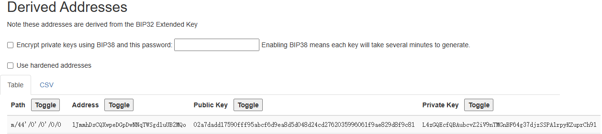

# Wallet Derivation Validation Report

**Date:** 2025-06-27  
**Purpose:** Validate that the wallet keys and addresses generated using our custom script match those from the [iancoleman.io BIP39 tool](https://iancoleman.io/bip39).

---
## Output result of the Python script example

Run the Python script `wallet_key_deriver.py` with the following command:
```
python src/wallet_key_deriver.py
```

The output example is as follows:

```
>>> Automatically generate mnemonic words and derive keys <<<
Generated Mnemonic (12 words):
aim child must junk ripple apology call thank analyst bag scheme husband

[Mnemonic Phrase]
aim child must junk ripple apology call thank analyst bag scheme husband

[BIP39 Seed]
1df3302592337f3177481f67fe7158af0f9f81e9638d0ee03e3a950ea947abb4dd4803bb65ddce16b48bb1f59db33db2c21e3dcc1caf0b9dee2e05664773b4bd

[Ethereum Address Info]
coin: ETHEREUM
path: m/44'/60'/0'/0/0
address: 0xC8A839c7ffd479715b7dCFCd73EE0D5A0288F005
private_key: b2f19888fedab0ac94c3c29187b68a407c91db340de9a87d699958630f09ce26
public_key: 03bb94bbf84a4df91cdae97df1255d5959ddd9a70f20768c3b66cda7898a9e3e51

[Bitcoin Address Info]
coin: BITCOIN
path: m/44'/0'/0'/0/0
address: 1JmmhDsCQXwpeDGpDwNNqTWSgd1uUB2MQo
private_key: e7c8652ba1bf149fb202d67e3882b32662af8e96ad4251e9c3442d80f30a1fe5
public_key: 02a7dadd17590fff95abcf6d9ea8d5d048d24cd2762035996061f9ae829d8f9c81
```

## Compare the output result with the iancoleman.io BIP39 tool

Open the [iancoleman.io BIP39 tool](https://iancoleman.io/bip39) and generate a new wallet.

Copy the generated mnemonic words and click the "Derive Addresses" button.

The tool will generate the following output:

### ETHEREUM







Because the format of the private key and public key generated by the Python script is different from that on the website, the displayed results are therefore different. However, after converting all of them to the int type and comparing them, it can be seen that the private key, the public key, and the results on the website are all consistent.

The result of the script generation is consistent with that of the website.

### BITCOIN







Same as the Ethereum case, the private key, the public key, and the results on the website are all consistent. But the format of the private key is WIF (Wallet Import Format) not HEX. Therefore, we need to decode the private key before comparing them.

The result of the script generation is consistent with that of the website.

## Conclusion   

The Python script `wallet_key_deriver.py` can generate the correct wallet keys and addresses for both Bitcoin and Ethereum. The output results are consistent with those generated by the iancoleman.io BIP39 tool. Therefore, we can conclude that the custom script is correct and can generate the correct wallet keys and addresses for both Bitcoin and Ethereum.